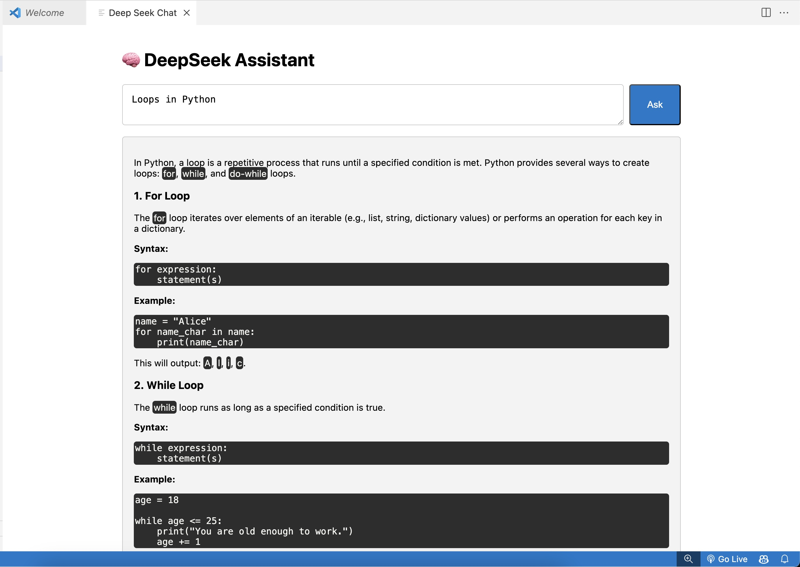

# DeepSeek VS Code Extension 🧠💻

Welcome to the **DeepSeek VS Code Extension**! This extension integrates **DeepSeek R1**, a powerful AI assistant, directly into Visual Studio Code to help developers streamline their workflows. The best part? It runs entirely **locally** using **Ollama**, ensuring complete privacy and zero dependency on the internet.



---

## Features 🚀

1. **Real-Time AI Interaction**  
   Chat with DeepSeek directly from a webview in VS Code. Ask questions, get coding assistance, or brainstorm ideas—all without leaving your editor.

2. **Dynamic Thinking Feedback**  
   While DeepSeek processes your input, it provides real-time updates (e.g., "Thinking...") to keep you informed.

3. **Beautifully Formatted Responses**  
   Final responses are rendered using `marked.js`, ensuring clean and professional markdown formatting for better readability.

4. **Privacy-First AI**  
   All processing happens locally on your machine using Ollama, so your data never leaves your system.

5. **Seamless Integration**  
   Designed to match VS Code’s themes and UI for a consistent and polished experience.

---

## Installation 🛠️

### Prerequisites
- [Visual Studio Code](https://code.visualstudio.com/) installed on your system.
- [Node.js](https://nodejs.org/) installed for development and packaging.
- [Ollama](https://ollama.ai/) installed and configured locally for running the DeepSeek R1 model.

### Steps to Install
1. Clone this repository:
   ```bash
   git clone https://github.com/yourusername/deepseek-vscode-extension.git
   cd deepseek-vscode-extension
   ```

2. Install dependencies:
   ```bash
   npm install
   ```

3. Compile the extension (if using TypeScript):
   ```bash
   npm run compile
   ```

4. Package the extension:
   ```bash
   vsce package
   ```

5. Install the `.vsix` file in VS Code:
   - Open the Extensions view (`Ctrl+Shift+X` or `Cmd+Shift+X` on macOS).
   - Click the `...` menu in the top-right corner and select **Install from VSIX...**.
   - Choose the generated `.vsix` file.

6. Activate the extension:
   - Open the Command Palette (`Ctrl+Shift+P` or `Cmd+Shift+P` on macOS).
   - Run `DeepSeek: Start`.

---

## Usage 💡

1. Open the Command Palette (`Ctrl+Shift+P` or `Cmd+Shift+P`) and run `DeepSeek: Start`.
2. A new webview panel will open with a chat interface.
3. Type your question or prompt into the text area and click "Ask".
4. While DeepSeek processes your input, you'll see a "Thinking..." message.
5. Once processing is complete, you'll receive a beautifully formatted response.

---

## How It Works 🔍

- The extension communicates with **Ollama**, which runs the DeepSeek R1 model locally.
- User input is sent to DeepSeek, which processes it and streams back responses.
- The extension dynamically handles `<think>` tags to display real-time feedback while processing.
- Final responses are rendered using `marked.js` for clean markdown formatting.

---

## Development Guide 🛠️

### Running in Development Mode
1. Clone the repository and install dependencies:
   ```bash
   git clone https://github.com/yourusername/deepseek-vscode-extension.git
   cd deepseek-vscode-extension
   npm install
   ```

2. Launch the extension in debug mode:
   - Open the project in VS Code.
   - Press `F5` to start debugging.
   - A new VS Code window will open with the extension running.

3. Modify code as needed, and use the debug console to view logs.

### File Structure
```
├── src/
│   ├── extension.ts        # Main entry point for the extension backend.
│   ├── webview/            # Contains HTML, CSS, and JS for the webview interface.
├── out/                    # Compiled JavaScript files (generated after build).
├── package.json            # Extension metadata and dependencies.
├── tsconfig.json           # TypeScript configuration file.
├── README.md               # Project documentation.
```

---

## Roadmap 🗺️

Planned features for future releases:
- Support for additional AI models via Ollama.
- Customizable interaction styles (e.g., themes, response formatting).
- Publish on the Visual Studio Code Marketplace for easy installation.
- Enhanced error handling and debugging tools.

---

## Credits 🙌

This project was inspired by [Fireship's video](https://www.youtube.com/@Fireship) on building VS Code extensions—thank you for providing such a great foundation!  

Special thanks to [Ollama](https://ollama.ai/) for enabling local AI capabilities with their amazing tools.

---

## Contributing 🤝

Contributions are welcome! If you’d like to contribute:
1. Fork this repository.
2. Create a new branch for your feature or bug fix:  
   ```bash
   git checkout -b feature-name
   ```
3. Commit your changes and push them:  
   ```bash
   git push origin feature-name
   ```
4. Open a pull request describing your changes.

---

## License 📜

This project is licensed under the MIT License—feel free to use it as you see fit!

---

## Contact 📬

If you have any questions or suggestions, feel free to reach out or open an issue on GitHub!